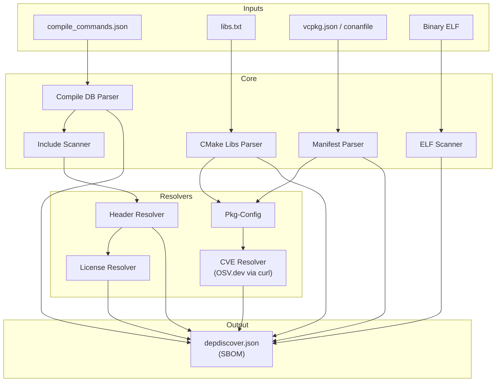

# depdiscover

**Native C++ Dependency Scanner & SBOM Generator**

[](https://opensource.org/licenses/MIT)
[]()
[]()

[](https://github.com/Zheng-Bote/depdiscover/releases)

[Report Issue](https://github.com/Zheng-Bote/depdiscover/issues) · [Request Feature](https://github.com/Zheng-Bote/depdiscover/pulls)

---

<!-- START doctoc generated TOC please keep comment here to allow auto update -->
<!-- DON'T EDIT THIS SECTION, INSTEAD RE-RUN doctoc TO UPDATE -->

<!-- END doctoc generated TOC please keep comment here to allow auto update -->

---

## Description

**depdiscover** is a lightweight, high-performance tool designed to bridge the gap between declared dependencies (manifests) and physical build artifacts. It scans your C++ project's build environment, analyzes binaries, checks for licenses, and queries vulnerabilities (CVEs) to generate a comprehensive Software Bill of Materials (SBOM) in JSON format.

## 🚀 Key Features

- **Hybrid Analysis**: Combines data from package manifests with actual build artifacts.
- **Multi-Source Parsing**:
  - Manifests: vcpkg.json, conanfile.txt
  - Build Data: compile_commands.json (Clang/CMake), libs.txt (CMake Targets)
  - Binaries: Native ELF scanner (analyzes DT_NEEDED / ldd equivalent)
- **Deep Inspection**:
  - Header Resolution: Maps logical includes to physical files on disk.
  - License Scanning: Detects licenses via static DB and file system heuristics.
  - Security (CVE): Live vulnerability check via OSV.dev API (using curl).
- **Structured Output**: Generates a detailed JSON report including metadata, file paths, licenses, and security status.

## 🏗 Architecture

The tool operates in three stages: **Input Parsing**, **Physical Scanning**, and **Metadata Enrichment**.



## 🛠 Prerequisites

To build and run depdiscover, you need:

- **C++ Compiler**: Supporting C++23 (e.g., GCC 13+, Clang 16+, MSVC VS2022 17.6+).
- **CMake**: Version 3.23 or higher.
- **Dependencies**:
- nlohmann_json (usually handled via CMake/Vcpkg).

### Runtime Requirements

- curl (must be installed in the system PATH for CVE queries).
- pkg-config (optional, for better system library resolution).

## 📦 Build Instructions

```bash
# 1. Clone the repository
git clone https://github.com/your-org/depdiscover.git
cd depdiscover

# 2. Create build directory
mkdir build && cd build

# 3. Configure (ensure nlohmann_json is found)
cmake ..

# 4. Build
cmake --build .
```

## 💻 Usage

depdiscover is a command-line tool. You can provide various input files to increase the accuracy of the result.

### Basic Command

```bash
./depdiscover -c ./compile_commands.json -o sbom.json
```

### Full Example

To get the most comprehensive report, provide as many inputs as possible:

```bash
./depdiscover \
 --name "MyApplication" \
 --compile-commands ../build/compile_commands.json \
 --libs ../build/libs.txt \
 --binary ../build/bin/myapp \
 --vcpkg ../vcpkg.json \
 --output report.json
```

### Options

| Flag | Long               | Description                                             |
| ---- | ------------------ | ------------------------------------------------------- |
| -c   | --compile-commands | Path to compile_commands.json (Input).                  |
| -l   | --libs             | Path to CMake generated libs.txt (Input).               |
| -b   | --binary           | Path to the executable binary for ELF analysis (Input). |
| -v   | --vcpkg            | Path to vcpkg.json manifest (Input).                    |
| -C   | --conan            | Path to conanfile.txt (Input).                          |
| -o   | --output           | Path for the generated JSON file (Output).              |
| -n   | --name             | Project name to appear in the report header.            |
| -h   | --help             | Show help message.                                      |

### 💡 Generating libs.txt (CMake Integration)

To enable the **--libs** parser, add the following to your project's CMakeLists.txt. This allows depdiscover to see CMake targets and header-only libraries that might not appear in the binary.

```cmake
# Add this at the end of your CMakeLists.txt
file(GENERATE OUTPUT "${CMAKE_BINARY_DIR}/libs.txt"
     CONTENT "$<TARGET_PROPERTY:YourTargetName,LINK_LIBRARIES>")
```

### 📄 Output Example

The generated JSON contains a metadata header and a list of dependencies.

```json
{
  "header": {
    "schema_version": "1.2",
    "scan_date": "2026-02-18",
    "tool": {
      "name": "depdiscover",
      "version": "1.0.0"
    },
    "project": {
      "name": "MyApplication",
      "workspace_root": "/home/user/projects/myapp"
    }
  },
  "dependencies": [
    {
      "name": "fmt",
      "version": "10.2.1",
      "type": "vcpkg",
      "source": "pkgconfig",
      "headers": ["/usr/include/fmt/core.h", "/usr/include/fmt/format.h"],
      "libraries": ["/usr/lib/x86_64-linux-gnu/libfmt.so.10"],
      "licenses": ["MIT"],
      "cves": [
        {
          "id": "SAFE",
          "severity": "NONE",
          "summary": "No known vulnerabilities found. Checked on 2026-02-18 via OSV.dev"
        }
      ]
    }
  ]
}
```

## 📜 License

This project is licensed under the MIT License - see the LICENSE file for details.

Copyright (c) 2026 ZHENG Robert

## Author

[](https://www.github.com/Zheng-Bote)

## Code Contributors


---

**Happy checking! 🚀** :vulcan_salute:
