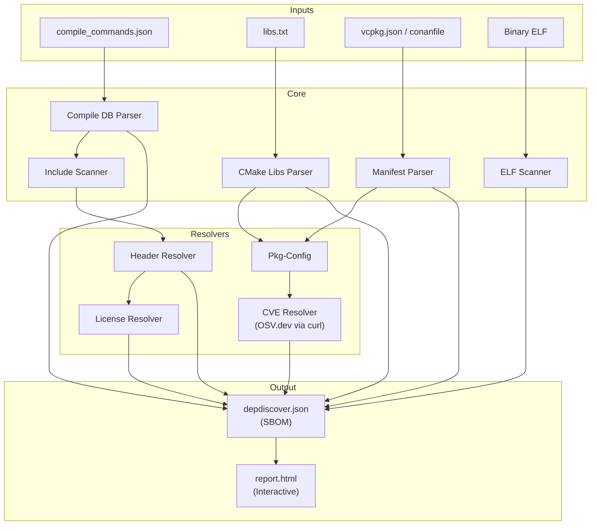
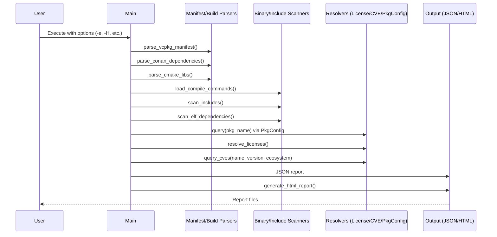

<!-- START doctoc generated TOC please keep comment here to allow auto update -->
<!-- DON'T EDIT THIS SECTION, INSTEAD RE-RUN doctoc TO UPDATE -->
**Table of Contents**

- [Architecture Documentation](#architecture-documentation)
  - [Overview](#overview)
  - [Component Diagram](#component-diagram)
  - [Sequence Diagram](#sequence-diagram)
  - [Key Parameters](#key-parameters)

<!-- END doctoc generated TOC please keep comment here to allow auto update -->

# Architecture Documentation

## Overview

**depdiscover** is designed as a modular dependency scanner. It follows a multi-stage pipeline:

1.  **Input Parsing**: Gathering data from various sources (manifests, build systems, binaries).
2.  **Physical Scanning**: Identifying actual files and symbols used in the build.
3.  **Metadata Enrichment**: Resolving licenses, querying vulnerabilities, and mapping headers.
4.  **Reporting**: Generating structured JSON and interactive HTML reports.

## Component Diagram

The following diagram illustrates the relationship between the different modules of the system.

## Sequence Diagram

The sequence of operations during a typical scan:

## Key Parameters

- **Ecosystem (`-e`)**: Allows specifying the OSV ecosystem (e.g., "Debian", "Alpine", "Ubuntu") to improve CVE matching accuracy.
- **HTML Report (`-H`)**: Generates an interactive HTML summary for easier human inspection.
