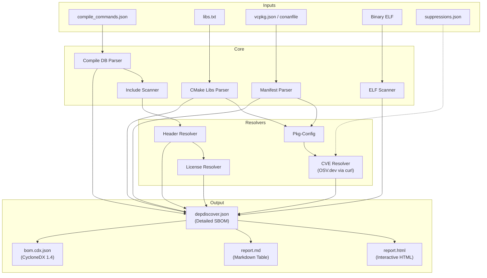
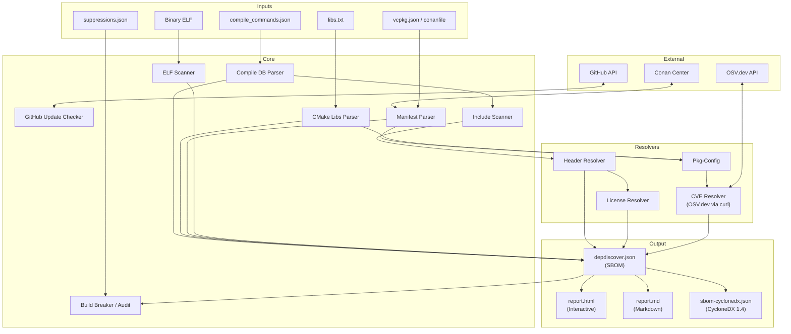
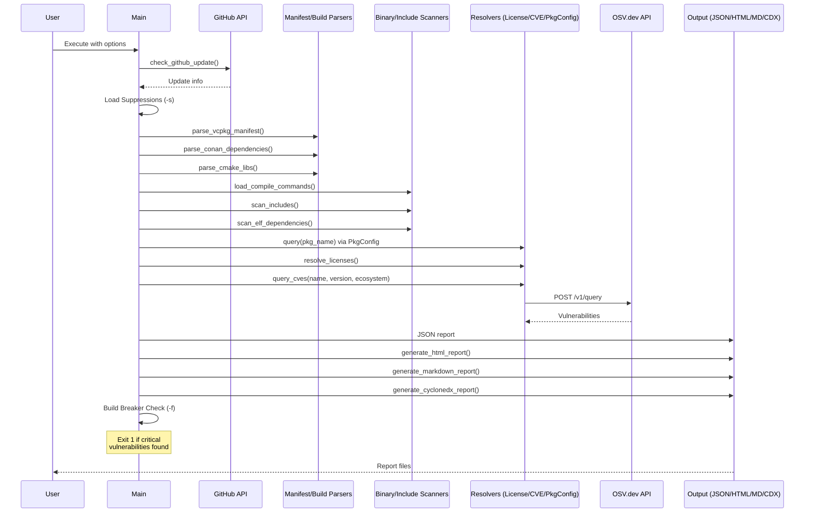
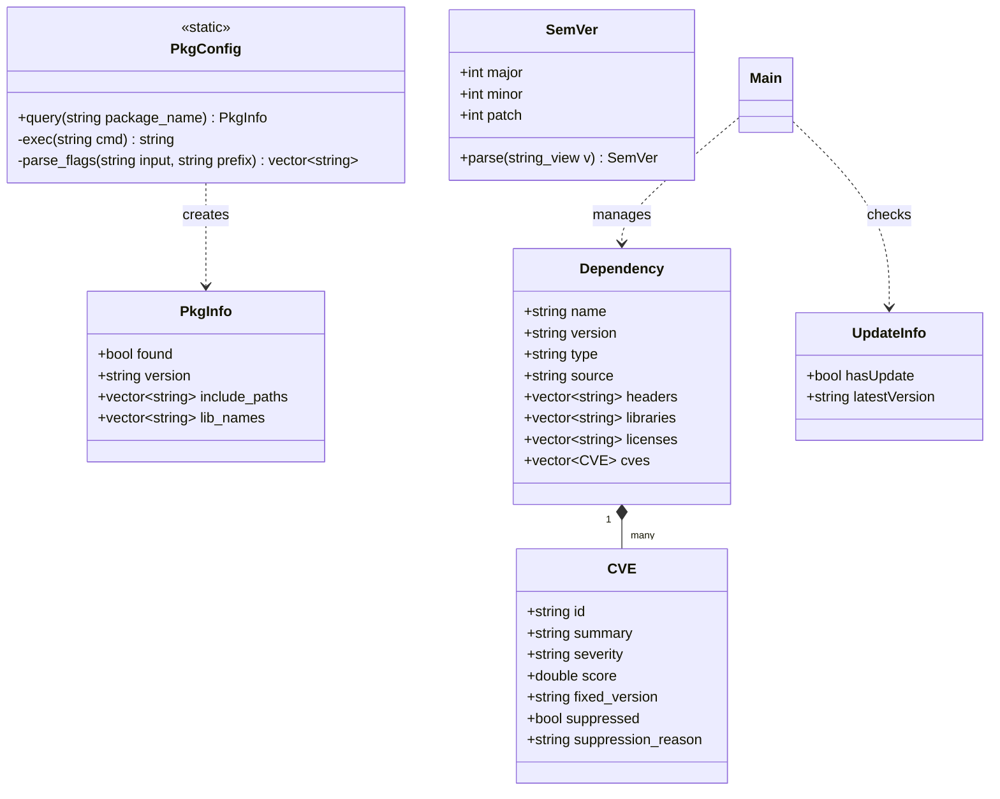

# Architecture Documentation

<!-- START doctoc generated TOC please keep comment here to allow auto update -->
<!-- DON'T EDIT THIS SECTION, INSTEAD RE-RUN doctoc TO UPDATE -->
**Table of Contents**

- [Overview](#overview)
- [Component Diagram](#component-diagram)
- [Sequence Diagram](#sequence-diagram)
- [Class Diagram](#class-diagram)
- [Key Features](#key-features)
- [Key Parameters](#key-parameters)

<!-- END doctoc generated TOC please keep comment here to allow auto update -->

## Overview

**depdiscover** is a modular dependency scanner and SBOM (Software Bill of Materials) generator for C++ projects. It identifies used libraries and headers by combining manifest parsing, build system analysis, and binary scanning.

The application follows a structured pipeline:

1. **Self-Check**: Verifies if a newer version of the tool is available on GitHub.
2. **Input Parsing**: Gathering data from various sources (vcpkg, Conan, CMake, Compile Commands).
3. **Physical Scanning**: Identifying actual files (headers) and symbols (binaries) used in the project.
4. **Metadata Enrichment**: Resolving licenses via heuristics and querying OSV.dev for vulnerabilities (CVEs).
5. **Audit & Compliance**: Applying vulnerability suppressions and enforcing CVSS threshold policies (Build Breaker).
6. **Reporting**: Generating structured JSON, interactive HTML, and industry-standard CycloneDX reports.

## Component Diagram

The following diagram illustrates the relationship between the different modules and external services.

## Sequence Diagram

The sequence of operations during a typical scan:

## Class Diagram

The following diagram shows the key data structures and their relationships.

## Key Features

- **Multi-Source Analysis**: Combines high-level manifests with low-level binary analysis for high accuracy.
- **Security Audit**: Automated vulnerability checking via OSV.dev.
- **Build Breaker**: Integration into CI/CD pipelines to block builds with critical vulnerabilities.
- **Compliance**: Identification of licenses and generation of CycloneDX 1.4 compliant SBOMs.

## Key Parameters

- **Ecosystem (`-e`)**: Allows specifying the OSV ecosystem (e.g., "Debian", "Alpine", "Ubuntu") to improve CVE matching accuracy.
- **Fail on CVSS (`-f`)**: Sets the threshold for the Build Breaker (e.g., 7.0 for High).
- **Suppressions (`-s`)**: Path to a JSON file to ignore specific CVEs (with reason).
- **HTML Report (`-H`)**: Generates an interactive HTML summary for human inspection.
- **CycloneDX Output (`-x`)**: Generates industry-standard SBOM for compliance workflows.
