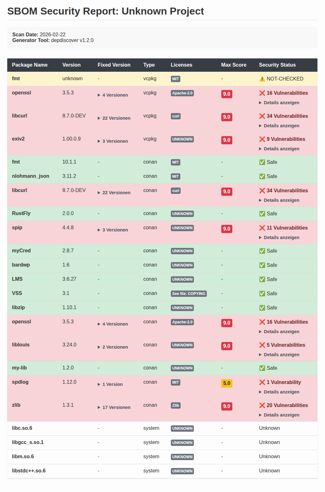
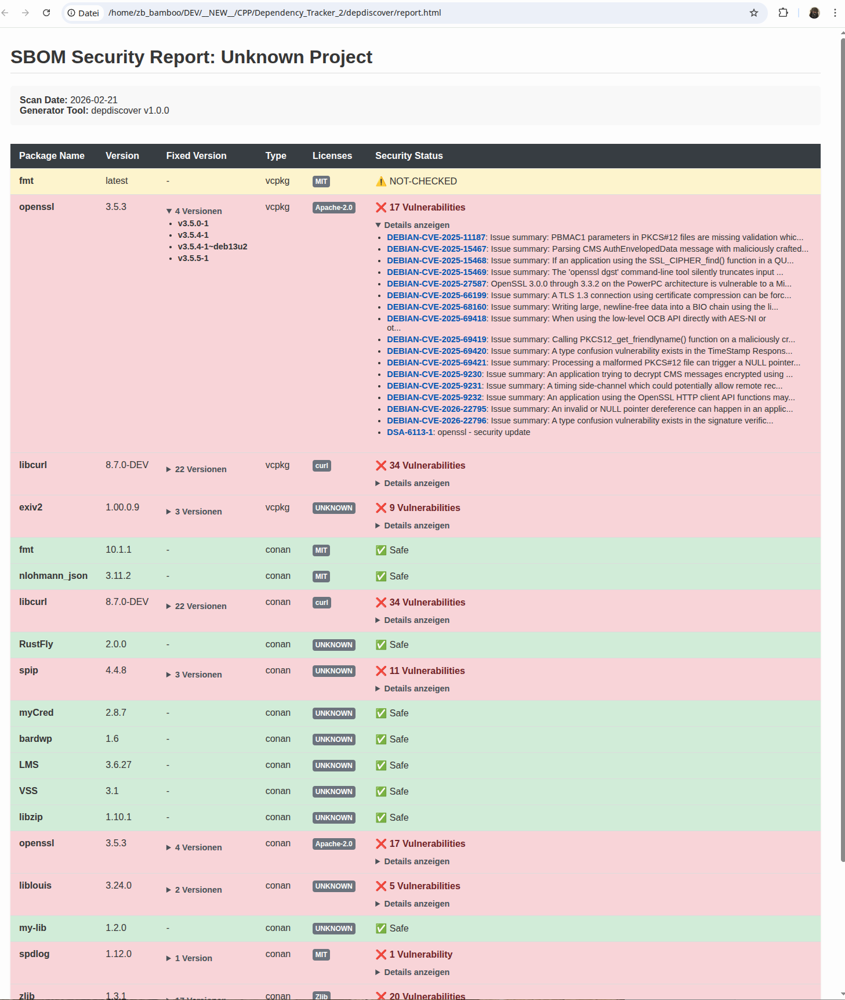
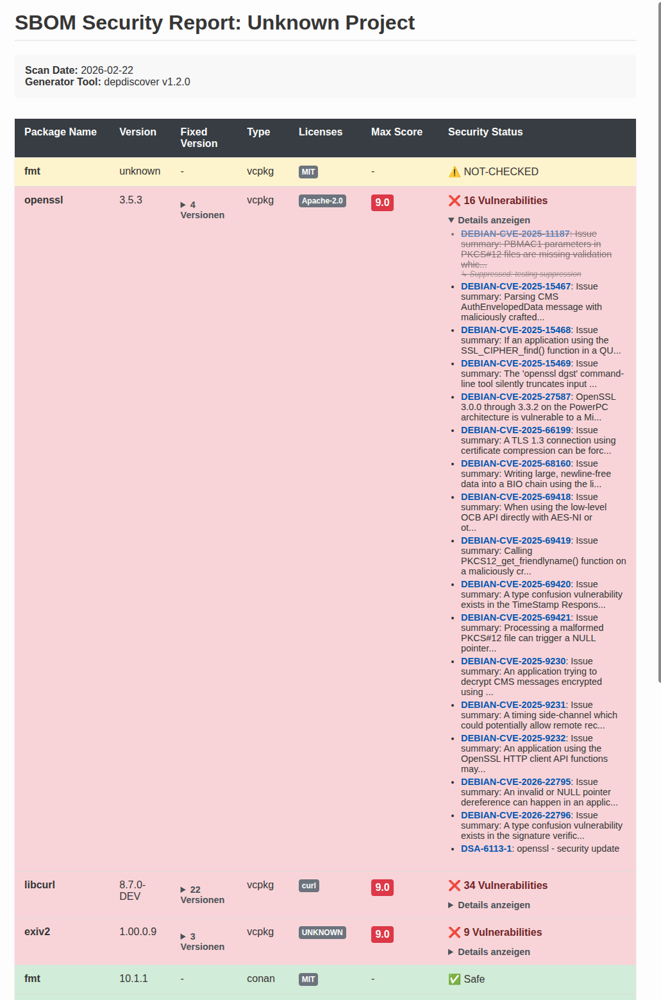
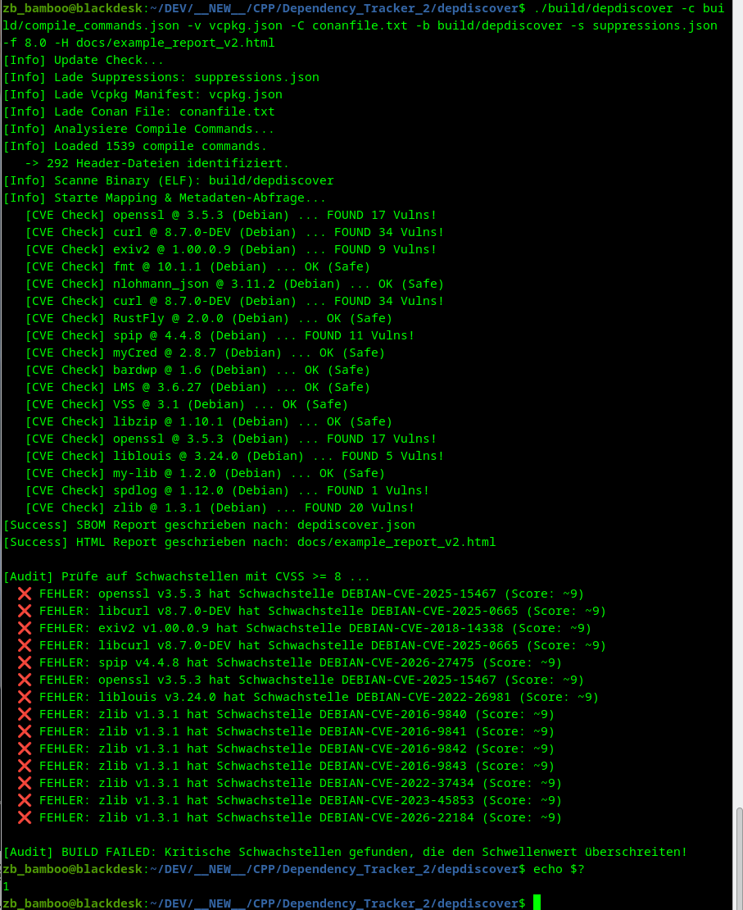

# depdiscover Documentation

Welcome to the documentation for **depdiscover**, a native C++ Dependency Scanner and SBOM (Software Bill of Materials) Generator.

<!-- START doctoc generated TOC please keep comment here to allow auto update -->
<!-- DON'T EDIT THIS SECTION, INSTEAD RE-RUN doctoc TO UPDATE -->

**Table of Contents**

- [depdiscover Documentation](#depdiscover-documentation)
  - [Core Documentation](#core-documentation)
  - [Screenshots and Reports](#screenshots-and-reports)
    - [Overview of the HTML Report](#overview-of-the-html-report)
    - [Vulnerability Details](#vulnerability-details)
    - [Vulnerability Suppression](#vulnerability-suppression)
    - [Build Breaker (Fail on CVSS)](#build-breaker-fail-on-cvss)

<!-- END doctoc generated TOC please keep comment here to allow auto update -->

## Core Documentation

- [Architecture Overview](architecture/architecture.md) - Detailed information about the system design, components, and data flow.

## Screenshots and Reports

### Overview of the HTML Report

The interactive HTML report provides a comprehensive overview of all project dependencies, including their versions, licenses, and security status.

### Vulnerability Details

When vulnerabilities are detected, the report displays detailed information from OSV.dev, including CVSS scores and fixed versions.

### Vulnerability Suppression

The tool allows for manual suppression of specific CVEs with a provided reason, which is reflected in the final report.

### Build Breaker (Fail on CVSS)

Integrate depdiscover into your CI/CD pipeline. You can configure the tool to fail the build if vulnerabilities above a certain CVSS threshold are found.

---

_Created by ZHENG Robert. Copyright (c) 2026._
